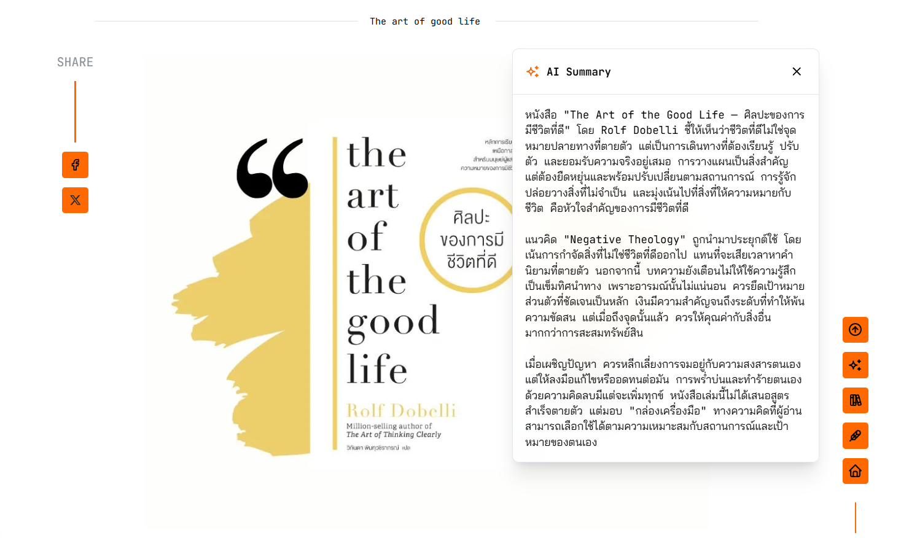

<!---->

## :wave: Hi there !

**alohadancemoew** : A personal blog where I learn stuff in public so you don't have to. You're welcome. :v:

I break things, write about them, and occasionally fix them — all in one place. Think of it as a digital scrapbook powered by Notion, held together by Next.js, and occasionally sprinkled with AI magic. Feel free to grab a coffee (or tea, I don't judge) and look around.

---

## 📄 Pages

- **`/`** — Where the magic happens (and by magic I mean a profile pic and some buttons).
- **`/posts`** — All the stuff I wrote. Filter, search, scroll until your finger hurts.
- **`/posts/[slug]`** — The actual article. Read it, or just click AI Summary — I won't tell anyone.
- **`/tags/[slug]`** — Posts about one thing, because you have commitment issues.
- **`/about`** — Who is this person and why are they blogging? Find out here.
- **`/note`** — Random thoughts that didn't deserve their own post. The junk drawer of the blog.
- **`/hobbies`** — Things I do when I'm not breaking the production build.

---

## ✨ Core Features

- **📝 Notion-Powered CMS** — Write in Notion, it magically appears on the blog. No deploy, no drama, no yelling at CI pipelines.
<!--- **🎵 Music Player** — Ambient beats while you scroll. Comes with a visualizer that looks cool even if you have no idea what's happening.-->
- **🔍 Spotlight Search** — Hit **Cmd+K** (or **/**) and find anything faster than you can find your car keys.
- **🎨 Beautiful Design** — Glassmorphism, dark/light mode, smooth animations. Your eyes will thank you (probably).
<!--- **💬 Community Comments** — Powered by GitHub Discussions. Yes, you can argue with strangers in the comments.-->
- **🏷️ Smart Tag Filtering** — Click a tag, see related posts. It's like therapy but for information overload.

---

## 🤖 AI Summary - New Feature! yahoo~

Respects your 7-line reading quota per year.

Hit the button → AI reads the wall of text for you → you get the gist. No tabs, no scrolling, just vibes. Then spend remaining time on Tiktok.

## 📂 Post Categories

Posts are sorted into three categories, because "miscellaneous" is overused:

- **🧠 today-i-learned** — Tiny nuggets of wisdom I picked up today. Use them to look smart at dinner parties.
- **📚 i-read-a-lot** — Books I've inhaled recently, plus highlights so you can skip the reading and steal the good parts.
- **🍿 no-work-today** — Movies, anime, manga, and other glorious time-wasters for your day off. You're welcome.

---

## :four_leaf_clover: Technologies

To learn more, take a look at the following resources:

- [Next.js Documentation](https://nextjs.org/docs) - learn about Next.js features and API.
- [Mantine](https://mantine.dev/) - A fully featured React components library.
- [MDX](https://mdxjs.com/) - Markdown for the component era.
- [Notion API](https://developers.notion.com/) - Connect Notion pages and databases to the tools you use every day, creating powerful workflows.
- [react-notion-x](https://github.com/NotionX/react-notion-x) - Fast and accurate React renderer for Notion. TS batteries included.
- [Vercel AI SDK](https://sdk.vercel.ai/) - AI toolkit for streaming text, structured outputs, and generative UI.

## 🗺️ Roadmap

- [ ] ~~Exciting new features~~
- [x] Do nothing
- [ ] Maybe fix that one bug I've been ignoring
- [ ] ~~Rewrite everything in Rust~~
- [ ] Probably just add more categories

I'll get to it. Eventually. Maybe. Don't hold your breath. 🤷
